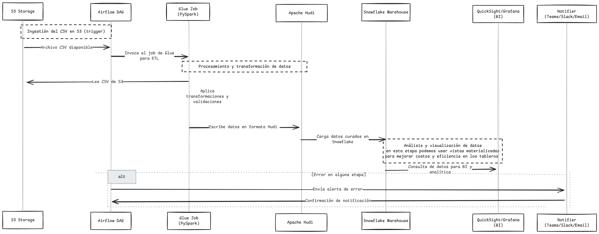

# LD-nequi-data-pipeline

## Propuesta para un Pipeline de Datos Moderno

### Introducción

Aca explico cómo montar un pipeline de datos utilizando aws y herramientas modernas escalables tambien buenas prácticas en el diseño del codigo. La idea es contar con una solución integral que abarque desde la ingesta y transformación de datos hasta su validación y análisis, apoyándonos en herramientas como **AWS**, **Airflow** para orquestación, **AWS Glue (PySpark)** para procesamiento y **Terraform** para gestionar la infraestructura.

Además, se implementa un enfoque de **Test-Driven Development (TDD)**, aplicando principios **SOLID** y de **Clean Architecture** para que el código sea modular, fácil de mantener y escalable.

### Objetivos de la Propuesta

Con esta solución buscamos:

- **Automatizar** todo el ciclo de procesamiento de datos, desde la ingesta hasta la visualización.
- **Garantizar la calidad y el versionado** de los datos usando **Apache Hudi**.
- **Facilitar el análisis** cargando los datos en un **data warehouse (Snowflake)** e integrándolos con herramientas de **BI**.
- **Asegurar la resiliencia** del pipeline mediante notificaciones automáticas (por ejemplo, con **SES, Slack y Teams**) en caso de fallos.
- **Implementar un entorno de despliegue continuo** y validación de código con **Terraform y GitHub Actions**.

### Arquitectura y Flujo de Datos

El pipeline se estructura de la siguiente manera:

1. **Ingestión y Trigger**

   - Cargas archivos **CSV** en un **bucket de S3**, lo que dispara un **DAG en Airflow**.

2. **Procesamiento y Curado**

   - **Airflow** orquesta un **job en AWS Glue**, donde **PySpark** lee el **CSV**, aplica transformaciones y validaciones, y cura los datos usando **Apache Hudi**.
   - Los datos procesados se almacenan en **S3** y, opcionalmente, se cargan en **Snowflake** para análisis.

3. **Notificaciones**

   - Si se produce algún error, se envía una notificación automática vía **email, Slack o Teams**.

4. **Análisis y Visualización**
   - Los datos en **Snowflake** se integran con herramientas de **BI** como **QuickSight** o **Grafana** para facilitar su análisis y visualización.

# Secuencia del Flujo



# Diagrama Arquitectura


---

## Estructura del Repositorio

La organización de carpetas está diseñada para separar responsabilidades y facilitar el mantenimiento y la escalabilidad. La estructura es la siguiente:

La estructura de carpetas está diseñada para separar las responsabilidades y facilitar el mantenimiento y la escalabilidad. La organización se realiza de la siguiente manera:

## Estructura del Proyecto

```bash
Proyecto/
├── README.md              # Documento final (esta propuesta)
├── docs/                  # Documentación adicional (diagramas, presentaciones, etc.)
│   ├── higlevel.png       # Diagrama de arquitectura high-level
│   ├── secuencia.png      # Diagrama de secuencia del flujo de datos
│   └── modelo_operativo.md # Modelo operativo y plan de soporte
├── airflow/               # Código y configuraciones de Airflow
│   ├── dags/              # Definición de DAGs para la orquestación
│   │   └── transactions_etl.py
│   ├── tests/             # Tests unitarios/integración para los DAGs
│   │   └── test_transactions_etl.py
│   └── plugins/           # Operadores y hooks personalizados (si es necesario)
├── glue/                  # Código para AWS Glue (PySpark)
│   ├── scripts/           # Scripts de transformación y procesamiento
│   │   └── script_pyspark.py
│   ├── tests/             # Tests para validar la lógica de transformación en PySpark
│   │   └── test_script_pyspark.py
├── notifications/         # Módulo de notificaciones
│   ├── notifier.py        # Clase Notifier con métodos para email, Slack y Teams
│   ├── tests/             # Tests para el módulo de notificaciones
│   │   └── test_notifier.py
├── terraform/             # Configuración de infraestructura como código
│   ├── main.tf            # Definición de recursos (S3, IAM, etc.)
│   ├── variables.tf
│   ├── outputs.tf
│   └── modules/           # Módulos reutilizables
├── ci/                    # Configuraciones y scripts de CI/CD con GitHub Actions
│   └── workflows/         # Workflows YAML (por ejemplo, terraform.yml)
└── data/                  # Archivos de datos de ejemplo (CSV)
    └── transactions.csv
```

---

## Pipeline de CI/CD y Gestión de TDD

El proceso de integración y despliegue se automatiza con **GitHub Actions** mediante flujos de trabajo específicos para cada componente:

- **Terraform**: Validación, planificación y despliegue de la infraestructura.
- **Airflow**: Validación y pruebas de los DAGs.
- **AWS Glue/PySpark**: Ejecución de tests unitarios para confirmar las transformaciones de datos.
- **Notificaciones**: Pruebas del módulo Notifier.

Cada pipeline se activa solo cuando se detectan cambios en las carpetas correspondientes, lo que garantiza una **integración continua sin afectar el entorno de producción**.

---

## Principios de SOLID y Clean Architecture

- **SOLID**  
  La implementación del ETL en **PySpark** y el módulo **Notifier** sigue un enfoque orientado a objetos, donde cada clase tiene una única responsabilidad, mejorando la mantenibilidad y escalabilidad.

- **Clean Architecture**  
  La solución se organiza en **capas independientes** (orquestación, procesamiento, notificaciones e infraestructura), lo que evita que los cambios en un módulo impacten a los demás y facilita la evolución del proyecto.

---

## Ventajas de la Propuesta

- **Modularidad y Escalabilidad**:  
  La estructura del proyecto permite crecer de forma ordenada y controlada.

- **Automatización Integral**:  
  La combinación de **Terraform** y **GitHub Actions** asegura despliegues automáticos, seguros y consistentes.

- **Calidad Asegurada con TDD**:  
  La ejecución de pruebas unitarias e integración permite detectar errores en etapas tempranas del desarrollo.

- **Flexibilidad y Configurabilidad**:  
  El uso de variables de entorno y parámetros configurables facilita la adaptación a distintos entornos sin necesidad de modificar el código base.

- **Buenas Prácticas de Desarrollo**:  
  Aplicar los principios **SOLID** y **Clean Architecture** garantiza un código limpio, mantenible y fácil de extender para futuras mejoras.

---

## Conclusión

Esta propuesta presenta un **pipeline de datos moderno y eficiente** que abarca desde la **ingesta en S3**, pasando por un **ETL con AWS Glue y Apache Hudi**, hasta la **carga en un data warehouse y el análisis con herramientas de BI**.

La **automatización del despliegue con Terraform y GitHub Actions**, combinada con el uso de **TDD, SOLID y Clean Architecture**, asegura una solución robusta, escalable y adaptable a futuras necesidades. Este enfoque es la base ideal para proyectos de ingeniería de datos que requieren alta calidad, eficiencia y capacidad de evolución en entornos dinámicos.
