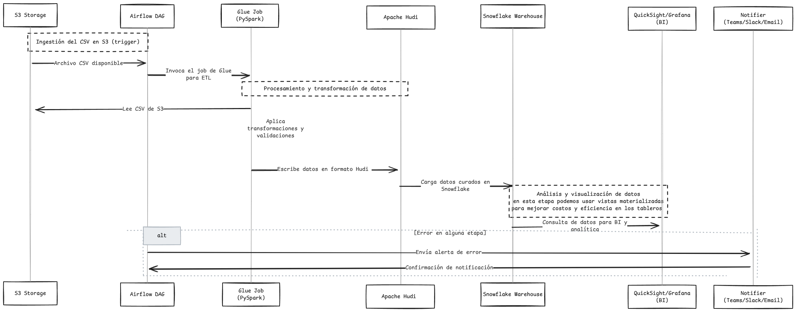
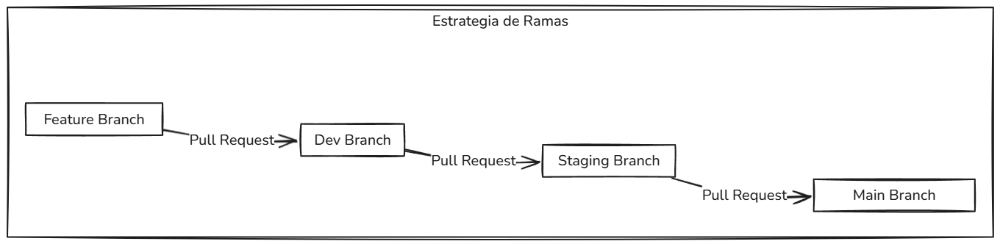
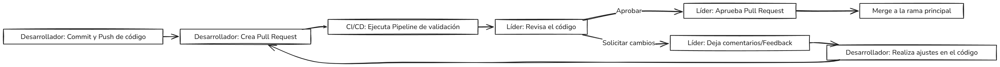
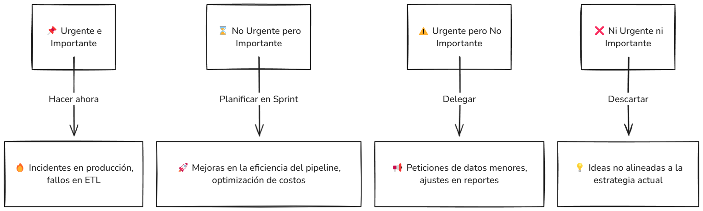

# LD-nequi-data-pipeline

## Propuesta para un Pipeline de Datos Moderno

### Introducción

Aca explico cómo montar un pipeline de datos utilizando aws y herramientas modernas escalables tambien buenas prácticas en el diseño del codigo. La idea es contar con una solución integral que abarque desde la ingesta y transformación de datos hasta su validación y análisis, apoyándonos en herramientas como **AWS**, **Airflow** para orquestación, **AWS Glue (PySpark)** para procesamiento y **Terraform** para gestionar la infraestructura.

Además, se implementa un enfoque de **Test-Driven Development (TDD)**, aplicando principios **SOLID** y de **Clean Architecture** para que el código sea modular, fácil de mantener y escalable.

### Objetivos de la Propuesta

Con esta solución buscamos:

- **Automatizar** todo el ciclo de procesamiento de datos, desde la ingesta hasta la visualización.
- **Garantizar la calidad y el versionado** de los datos usando **Apache Hudi**.
- **Facilitar el análisis** cargando los datos en un **data warehouse (Snowflake)** e integrándolos con herramientas de **BI**.
- **Asegurar la resiliencia** del pipeline mediante notificaciones automáticas (por ejemplo, con **SES, Slack y Teams**) en caso de fallos.
- **Implementar un entorno de despliegue continuo** y validación de código con **Terraform y GitHub Actions**.

### Arquitectura y Flujo de Datos

El pipeline se estructura de la siguiente manera:

1. **Ingestión y Trigger**

   - Cargas archivos **CSV** en un **bucket de S3**, lo que dispara un **DAG en Airflow**.

2. **Procesamiento y Curado**

   - **Airflow** orquesta un **job en AWS Glue**, donde **PySpark** lee el **CSV**, aplica transformaciones y validaciones, y cura los datos usando **Apache Hudi**.
   - Los datos procesados se almacenan en **S3** y, opcionalmente, se cargan en **Snowflake** para análisis.

3. **Notificaciones**

   - Si se produce algún error, se envía una notificación automática vía **email, Slack o Teams**.

4. **Análisis y Visualización**
   - Los datos en **Snowflake** se integran con herramientas de **BI** como **QuickSight** o **Grafana** para facilitar su análisis y visualización.

# Secuencia del Flujo



# Diagrama Arquitectura


---

## Estructura del Repositorio

La organización de carpetas está diseñada para separar responsabilidades y facilitar el mantenimiento y la escalabilidad. La estructura es la siguiente:

La estructura de carpetas está diseñada para separar las responsabilidades y facilitar el mantenimiento y la escalabilidad. La organización se realiza de la siguiente manera:

## Estructura del Proyecto

```bash
Proyecto/
├── README.md              # Documento final (esta propuesta)
├── docs/                  # Documentación adicional (diagramas, presentaciones, etc.)
│   ├── higlevel.png       # Diagrama de arquitectura high-level
│   ├── secuencia.png      # Diagrama de secuencia del flujo de datos
│   └── modelo_operativo.md # Modelo operativo y plan de soporte
├── airflow/               # Código y configuraciones de Airflow
│   ├── dags/              # Definición de DAGs para la orquestación
│   │   └── transactions_etl.py
│   ├── tests/             # Tests unitarios/integración para los DAGs
│   │   └── test_transactions_etl.py
│   └── plugins/           # Operadores y hooks personalizados (si es necesario)
├── glue/                  # Código para AWS Glue (PySpark)
│   ├── scripts/           # Scripts de transformación y procesamiento
│   │   └── script_pyspark.py
│   ├── tests/             # Tests para validar la lógica de transformación en PySpark
│   │   └── test_script_pyspark.py
├── notifications/         # Módulo de notificaciones
│   ├── notifier.py        # Clase Notifier con métodos para email, Slack y Teams
│   ├── tests/             # Tests para el módulo de notificaciones
│   │   └── test_notifier.py
├── terraform/             # Configuración de infraestructura como código
│   ├── main.tf            # Definición de recursos (S3, IAM, etc.)
│   ├── variables.tf
│   ├── outputs.tf
│   └── modules/           # Módulos reutilizables
├── ci/                    # Configuraciones y scripts de CI/CD con GitHub Actions
│   └── workflows/         # Workflows YAML (por ejemplo, terraform.yml)
└── data/                  # Archivos de datos de ejemplo (CSV)
    └── transactions.csv
```

---

## Pipeline de CI/CD y Gestión de TDD

El proceso de integración y despliegue se automatiza con **GitHub Actions** mediante flujos de trabajo específicos para cada componente:

- **Terraform**: Validación, planificación y despliegue de la infraestructura.
- **Airflow**: Validación y pruebas de los DAGs.
- **AWS Glue/PySpark**: Ejecución de tests unitarios para confirmar las transformaciones de datos.
- **Notificaciones**: Pruebas del módulo Notifier.

Cada pipeline se activa solo cuando se detectan cambios en las carpetas correspondientes, lo que garantiza una **integración continua sin afectar el entorno de producción**.

### Almacenamiento de DAGs y Jobs

- Los **DAGs de Airflow** y los **scripts de transformación en PySpark** se almacenan en **buckets S3 específicos por ambiente** (`dev`, `staging` y `prod`).
- Airflow y Glue acceden a estos scripts desde sus respectivos buckets para garantizar **versionado, aislamiento y seguridad**.
- La estructura en S3 es la siguiente:

```bash
s3://ld-poc-nequi-dev/dags/
s3://ld-poc-nequi-dev/jobs/
s3://ld-poc-nequi-staging/dags/
s3://ld-poc-nequi-staging/jobs/
s3://ld-poc-nequi-prod/dags/
s3://ld-poc-nequi-prod/jobs/
```

## propuesta para la estrategia de ramas Eficiente en un equipo colaborativo



## propuesta para el pipline de deploy haciendo revisión de codigo



---

## Principios de SOLID y Clean Architecture

- **SOLID**  
  La implementación del ETL en **PySpark** y el módulo **Notifier** sigue un enfoque orientado a objetos, donde cada clase tiene una única responsabilidad, mejorando la mantenibilidad y escalabilidad.

- **Clean Architecture**  
  La solución se organiza en **capas independientes** (orquestación, procesamiento, notificaciones e infraestructura), lo que evita que los cambios en un módulo impacten a los demás y facilita la evolución del proyecto.

---

## Ventajas de la Propuesta

- **Modularidad y Escalabilidad**:  
  La estructura del proyecto permite crecer de forma ordenada y controlada.

- **Automatización Integral**:  
  La combinación de **Terraform** y **GitHub Actions** asegura despliegues automáticos, seguros y consistentes.

- **Calidad Asegurada con TDD**:  
  La ejecución de pruebas unitarias e integración permite detectar errores en etapas tempranas del desarrollo.

- **Flexibilidad y Configurabilidad**:  
  El uso de variables de entorno y parámetros configurables facilita la adaptación a distintos entornos sin necesidad de modificar el código base.

- **Buenas Prácticas de Desarrollo**:  
  Aplicar los principios **SOLID** y **Clean Architecture** garantiza un código limpio, mantenible y fácil de extender para futuras mejoras.

---

# Modelo Operativo

[Modelo Operativo](docs/modelo_operativo.md)


# Gestión del Pipeline con Scrum y Priorización Eisenhower

Pa organizar bien el trabajo en el pipeline usamos **Scrum** (para que el equipo tenga claro que hacer en cada sprint) y la **Matriz de Eisenhower** (para no perder tiempo en cosas que no aportan valor real y enfocarnos en lo que de verdad importa).

## 🔹 **Scrum en el Pipeline**  

La idea es trabajar en **sprints de 2 semanas**, asi aseguramos que siempre hay avances sin meter cambios a lo loco que rompan todo.

### **🔹 Roles en Scrum:**  
- **Product Owner (PO)**: Define que se hace en cada sprint y que es lo más importante pa el negocio.  
- **Líder Técnico / Líder de Datos**:  
  - Se encarga de que la arquitectura y el código sean solidos.  
  - Revisa Pull Requests y asegura que todo pase los tests y validaciones.  
  - Evita que se hagan cosas sin sentido y que el equipo no pierda tiempo en tareas inútiles.  
- **Equipo de Desarrollo**: Mete mano al código, mejora el pipeline y mantiene todo andando.  
- **Stakeholders (Usuarios del pipeline)**: Dan feedback sobre que funciona y que no.  

### **🔹 Eventos en Scrum:**  
- **Daily Standup:** 15 min pa ver avances y si hay bloqueos.  
- **Sprint Planning:** Se define que se hace en las próximas 2 semanas podemos usar History points con fibonaci para mejorar la planificación.  
- **Sprint Review:** Se presenta lo que se terminó a los interesados.  
- **Sprint Retro:** Se analiza que mejorar pa la siguiente ronda.  

---

## **Priorización con la Matriz de Eisenhower**  

Pa que no nos llenemos de tareas sin sentido, usamos la **Matriz de Eisenhower**, que básicamente nos dice **qué hacer ya**, **qué se puede planear**, **qué se delega** y **qué se manda a la basura**.

### **🔹 Ejemplos de qué cae en cada categoría**:  

- **Urgente & Importante:**  
  - Airflow dejó de ejecutar DAGs → **Se arregla ya mismo.**  
  - Fallo en Glue que rompe el pipeline → **No se espera, se arregla.**  

- **No Urgente pero Importante:**  
  - Optimizar tiempos en Airflow → **Se mete en el próximo sprint.**  
  - Refactorizar código pa que sea más mantenible → **Se agenda.**  

- **Urgente pero No Importante:**  
  - Analista pide ayuda con una consulta SQL → **Se delega al equipo de BI.**  
  - Soporte a usuarios por una duda simple → **Se responde cuando se pueda.**  

- **Ni Urgente ni Importante:**  
  - Probar una tecnología nueva solo por curiosidad → **Se guarda pa después.**  
  - Un usuario quiere un dashboard experimental sin necesidad real → **Baja prioridad.**  

---

## **Conclusion**  
Con **Scrum**, nos organizamos sin volarnos la cabeza con tareas al azar.  
Con **Eisenhower**, no perdemos tiempo en cosas que no aportan nada.  
El **Líder Técnico/Líder de Datos** se encarga de que el codigo y la arquitectura no se vuelvan un desastre.  
Así, se trabaja bien sin que cada semana parezca un incendio nuevo. 

---

## **Gráfico de la Matriz de Eisenhower**  



## Conclusión

Esta propuesta presenta un **pipeline de datos moderno y eficiente** que abarca desde la **ingesta en S3**, pasando por un **ETL con AWS Glue y Apache Hudi**, hasta la **carga en un data warehouse y el análisis con herramientas de BI**.

La **automatización del despliegue con Terraform y GitHub Actions**, combinada con el uso de **TDD, SOLID y Clean Architecture**, asegura una solución robusta, escalable y adaptable a futuras necesidades. Este enfoque es la base ideal para proyectos de ingeniería de datos que requieren alta calidad, eficiencia y capacidad de evolución en entornos dinámicos.
