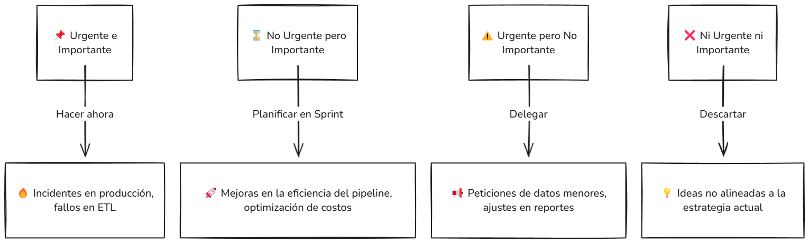

# Modelo Operativo para LD-nequi-data-pipeline

## 1. Introducción

Este modelo operativo define cómo vamos a manejar el pipeline de datos, asegurando que todo funcione de forma automática, segura y con alta calidad. Desde que llegan los archivos a S3 hasta que los analizamos en herramientas de BI. Se basa en prácticas como **TDD, SOLID y Clean Architecture**, y el uso de **CI/CD** para los despliegues.

## 2. Componentes del Modelo Operativo

### 2.1. Ingesta y Trigger
- **Qué pasa**:  
  - Se configuran **hooks en Airflow** para extraer datos desde bases de datos **SQL**.  
  - Se programan queries automatizadas que extraen y cargan los datos a un **bucket S3** o los procesan directamente en AWS Glue.  
  - También se cargan archivos **CSV** en un bucket de **S3** desde fuentes externas.  
  - La llegada de archivos o la ejecución programada de queries dispara un DAG en **Airflow**.  

- **Orígenes de datos**:  
  - Bases de datos relacionales (**PostgreSQL, MySQL, SQL Server, Oracle**).  
  - Archivos en formato **CSV, JSON o Parquet** desde sistemas externos.  
  - APIs o servicios de terceros que envían datos en tiempo programado.  

- **Quién lo cuida**:  
  - El equipo de **DataOps**, que monitorea la ingesta de datos y mantiene los pipelines funcionando correctamente.  

- **Métricas a seguir**:  
  - **Tiempo de ingesta**: cuánto tarda en extraerse y cargarse la data.  
  - **Porcentaje de éxito**: cantidad de archivos o queries completadas vs. fallidas.  
  - **Volumen de datos**: cantidad de registros procesados por ejecución.  

### 2.2. Procesamiento y Curado
- **Qué pasa**:  
  - **Airflow** orquesta jobs en **AWS Glue**.  
  - **PySpark** procesa los CSV, aplicando transformaciones, validaciones y curado con **Apache Hudi**.  
- **Quién lo cuida**:  
  - Equipo de ETL / Ingeniería de datos.  
- **Métricas a seguir**:  
  - Tiempo de procesamiento.  
  - Tasa de éxito en las transformaciones.  
  - Versionado correcto de los datos con Hudi.  

### 2.3. Notificaciones y Monitoreo
- **Qué pasa**:  
  - Alertas automáticas vía **SES, Slack y Teams**.  
  - **CloudWatch y Grafana** para logs y métricas.  
- **Quién lo cuida**:  
  - DevOps / Operaciones.  
- **Métricas a seguir**:  
  - Tiempo de respuesta ante incidentes.  
  - Número de alertas críticas resueltas.  

### 2.4. Almacenamiento y Análisis
- **Qué pasa**:  
  - Datos en **S3** y carga en **Snowflake** si es necesario.  
  - Conexión con herramientas de BI como **QuickSight** o **Grafana**.  
- **Quién lo cuida**:  
  - Equipo de BI y Data Analysts.  
- **Métricas a seguir**:  
  - Latencia en la carga a Snowflake.  
  - Calidad de los dashboards generados.  

### 2.5. CI/CD y Despliegue
- **Qué pasa**:  
  - **Terraform** maneja la infraestructura.  
  - **GitHub Actions** ejecuta validaciones cuando hay cambios en el código.  
  - Flujo de revisión con Pull Requests y code review.  
- **Quién lo cuida**:  
  - DevOps y desarrollo.  
- **Métricas a seguir**:  
  - Tiempo de despliegue.  
  - Cobertura de pruebas automatizadas.  

## 3. Roles y Responsabilidades

- **Líder de Datos**: Supervisa, revisa y aprueba el código.  
- **Desarrolladores/Ingenieros de Datos**: Desarrollan y mantienen el pipeline.  
- **DevOps/Operaciones**: Gestionan la infraestructura y monitoreo.  
- **Equipo de BI**: Crean y mantienen dashboards y análisis.  

## 4. Procesos y Flujos de Trabajo

### 4.1. Flujo de Datos
1. **Ingesta**: Llega un archivo a S3 → Se dispara un DAG en Airflow.  
2. **Procesamiento**: Airflow ejecuta Glue → PySpark transforma y cura los datos con Hudi.  
3. **Carga y Análisis**: Datos almacenados en S3 → Se cargan en Snowflake → Se analizan con BI.  

### 4.2. Flujo de Desarrollo y Despliegue
1. **Commit & Push**: El desarrollador sube cambios.  
2. **Pull Request & CI/CD**: Se ejecutan tests y validaciones.  
3. **Code Review**: El líder revisa y aprueba o pide cambios.  
4. **Merge & Despliegue**: Se integran los cambios y se despliegan con Terraform.  

## 5. Gestión de Incidencias y Soporte

- **Plan de Respuesta**: Se definen tiempos y responsables por tipo de incidente.  
- **Herramientas**: CloudWatch y alertas en Slack para monitoreo en tiempo real.  
- **Registro de Incidentes**: Documentación de cada fallo y mejoras postmortem.  

## 6. Mantenimiento y Mejora Continua

- **Revisiones Periódicas**: Se analizan logs y métricas para optimizar procesos.  
- **Capacitaciones**: Entrenamientos regulares para el equipo.  
- **Feedback y Ajustes**: Se toman acciones con base en métricas y retroalimentación.  

## 7. Seguridad y Cumplimiento

- **Cifrado de Datos**: Encriptación en reposo y en tránsito.  
- **Gestión de Accesos**: Roles y permisos en AWS IAM con privilegios mínimos.  
- **Auditoría**: CloudTrail y AWS Config para seguimiento de cambios.  

## 8. Documentación y Capacitación

- **Repositorio de Documentación**: En el directorio `docs/` (diagramas, manuales, etc.).  
- **Capacitaciones**: Formación periódica para nuevos integrantes.  
- **Protocolos Documentados**: Guías de operación, despliegue y manejo de incidencias.  

## 9 Gestión del Pipeline con Scrum y Priorización Eisenhower

Pa organizar bien el trabajo en el pipeline usamos **Scrum** (para que el equipo tenga claro que hacer en cada sprint) y la **Matriz de Eisenhower** (para no perder tiempo en cosas que no aportan valor real y enfocarnos en lo que de verdad importa).

## 🔹 **Scrum en el Pipeline**  

La idea es trabajar en **sprints de 2 semanas**, asi aseguramos que siempre hay avances sin meter cambios a lo loco que rompan todo.

### **🔹 Roles en Scrum:**  
- **Product Owner (PO)**: Define que se hace en cada sprint y que es lo más importante pa el negocio.  
- **Líder Técnico / Líder de Datos**:  
  - Se encarga de que la arquitectura y el código sean solidos.  
  - Revisa Pull Requests y asegura que todo pase los tests y validaciones.  
  - Evita que se hagan cosas sin sentido y que el equipo no pierda tiempo en tareas inútiles.  
- **Equipo de Desarrollo**: Mete mano al código, mejora el pipeline y mantiene todo andando.  
- **Stakeholders (Usuarios del pipeline)**: Dan feedback sobre que funciona y que no.  

### **🔹 Eventos en Scrum:**  
- **Daily Standup:** 15 min pa ver avances y si hay bloqueos.  
- **Sprint Planning:** Se define que se hace en las próximas 2 semanas podemos usar History points con fibonaci para mejorar la planificación.  
- **Sprint Review:** Se presenta lo que se terminó a los interesados.  
- **Sprint Retro:** Se analiza que mejorar pa la siguiente ronda.  

---

## **Priorización con la Matriz de Eisenhower**  

Pa que no nos llenemos de tareas sin sentido, usamos la **Matriz de Eisenhower**, que básicamente nos dice **qué hacer ya**, **qué se puede planear**, **qué se delega** y **qué se manda a la basura**.

### **🔹 Ejemplos de qué cae en cada categoría**:  

- **Urgente & Importante:**  
  - Airflow dejó de ejecutar DAGs → **Se arregla ya mismo.**  
  - Fallo en Glue que rompe el pipeline → **No se espera, se arregla.**  

- **No Urgente pero Importante:**  
  - Optimizar tiempos en Airflow → **Se mete en el próximo sprint.**  
  - Refactorizar código pa que sea más mantenible → **Se agenda.**  

- **Urgente pero No Importante:**  
  - Analista pide ayuda con una consulta SQL → **Se delega al equipo de BI.**  
  - Soporte a usuarios por una duda simple → **Se responde cuando se pueda.**  

- **Ni Urgente ni Importante:**  
  - Probar una tecnología nueva solo por curiosidad → **Se guarda pa después.**  
  - Un usuario quiere un dashboard experimental sin necesidad real → **Baja prioridad.**  

---

## **Conclusion**  
Con **Scrum**, nos organizamos sin volarnos la cabeza con tareas al azar.  
Con **Eisenhower**, no perdemos tiempo en cosas que no aportan nada.  
El **Líder Técnico/Líder de Datos** se encarga de que el codigo y la arquitectura no se vuelvan un desastre.  
Así, se trabaja bien sin que cada semana parezca un incendio nuevo. 

---

## **Gráfico de la Matriz de Eisenhower**  

## 10. Conclusión

Este modelo operativo nos permite tener control total sobre el pipeline, asegurando que todo fluya sin problemas, con buenas prácticas, monitoreo y automatización. La clave está en la mejora continua, con revisiones regulares y optimización en cada etapa.

